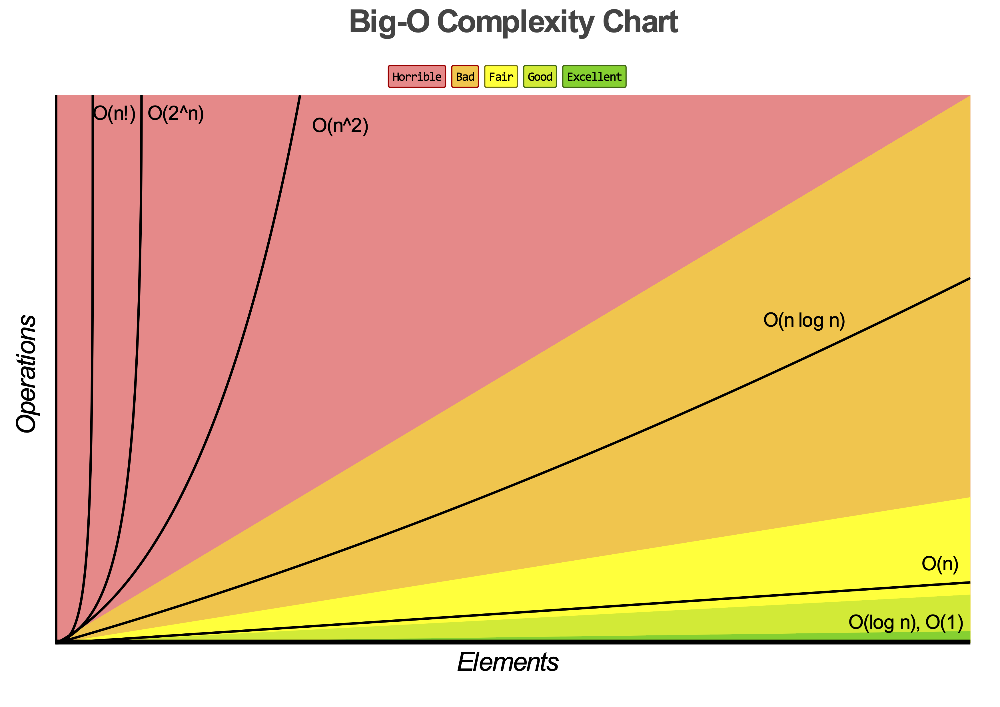
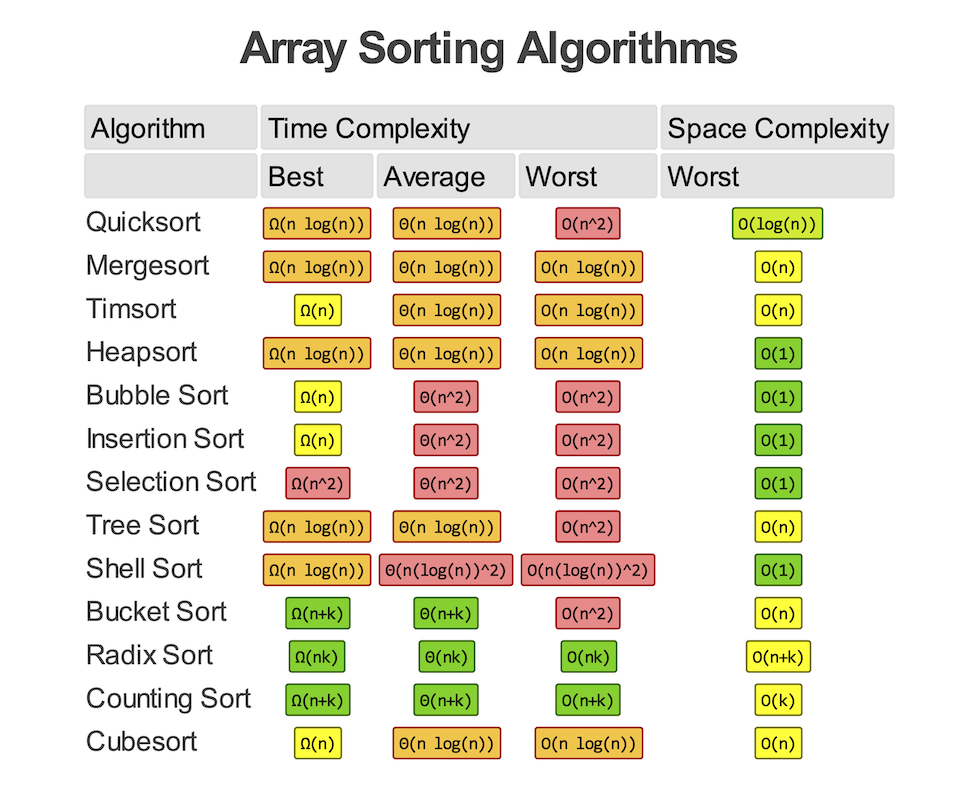
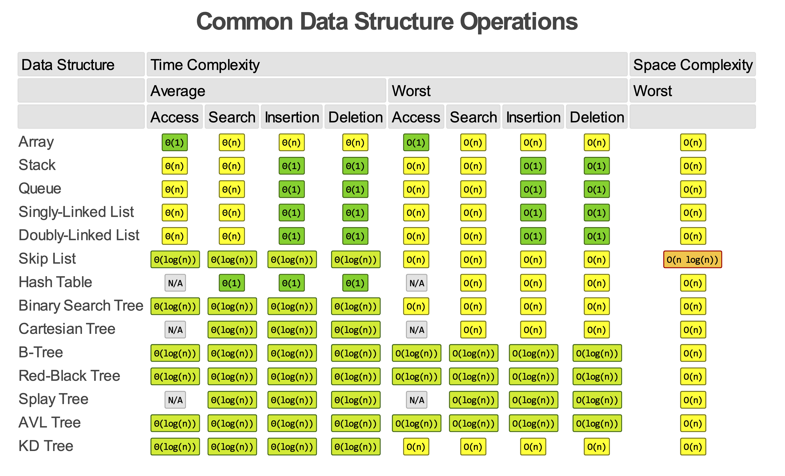

# [:books:]()Data Structures And Algorithms

“Data Structure is **about organizing and managing data effectively** such that we can perform specific operation efficiently, while Algorithm is a step-by-step procedure to be followed to reach the desired output”

* I Finished the following course [Data Structures and Algorithms: Deep Dive Using  Java](https://www.udemy.com/course/data-structures-and-algorithms-deep-dive-using-java/), and this repo contains my implementation while taking the course.

## Big-O Complexity Chart

<h2><a href="src/sorts" style="text-decoration:none">
 Sorting Algorithms.
</a></h2>

- [Bubble](src/sorts/bubble)

- [Selection](src/sorts/selection)

- [Insertion](src/sorts/insertion)

- [Shell](src/sorts/shell)

- [Merge](src/sorts/merge)

- [Quick](src/sorts/quick)

- [Counting](src/sorts/counting)

- [Radix](src/sorts/radix)

- [Bucket](src/sorts/bucket)

- [Heap](src/sorts/heap)

  

<h2><a href="src/sorts" style="text-decoration:none">
 Data Structures.
</a></h2>

- [Stack](src/stacks)

- [Queue](src/queue)

- [Singly-Linked List](src/lists/linkedlists/singly)

- [Doubly-Linked List](src/lists/linkedlists/doubly)

- [Hashtable](src/lists/linkedlists)

- [Linear Search](src/search/linear)

- [Binary Search](src/search/binary)

- [Binary Search Tree](src/trees/binary/search)

- [Heaps Tree](src/trees/heaps)

  

## ℹ️ Refrences:

​	[data structure definition](https://medium.com/swlh/differences-between-data-structures-and-algorithms-eed2c1872cfc)

​	[charts and tables](http://bigocheatsheet.com)

​	[course link](https://www.udemy.com/course/data-structures-and-algorithms-deep-dive-using-java/)

​	[icons](http://flaticon.com)

